# WeatherAPP

Description Welcome to my project! This is a Weather APP made in Javascript and
open-source weather API open-meteo.com. It allows users to quickly and easily
get the world weather forecast. Access hourly, weekly forecasts. I Developed a
weather app that get the user's location wia ip address. Users also can search
city and get weather in this time .I hope you enjoy!
